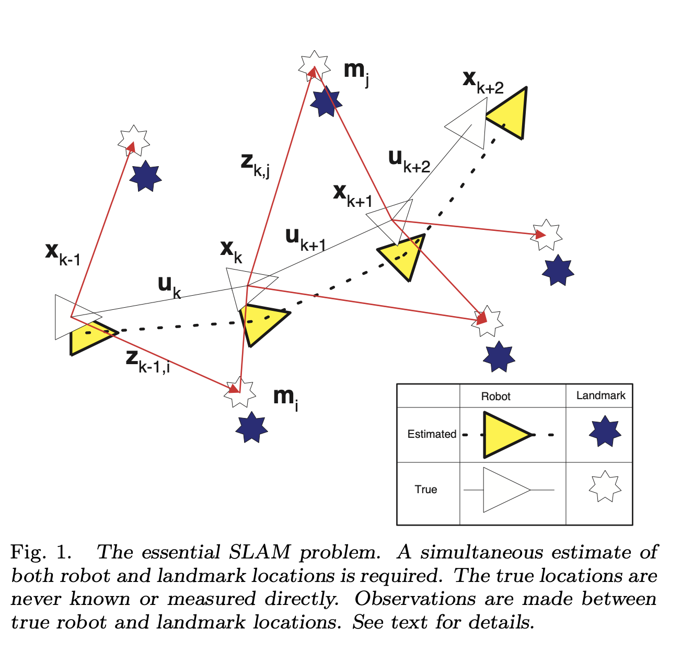
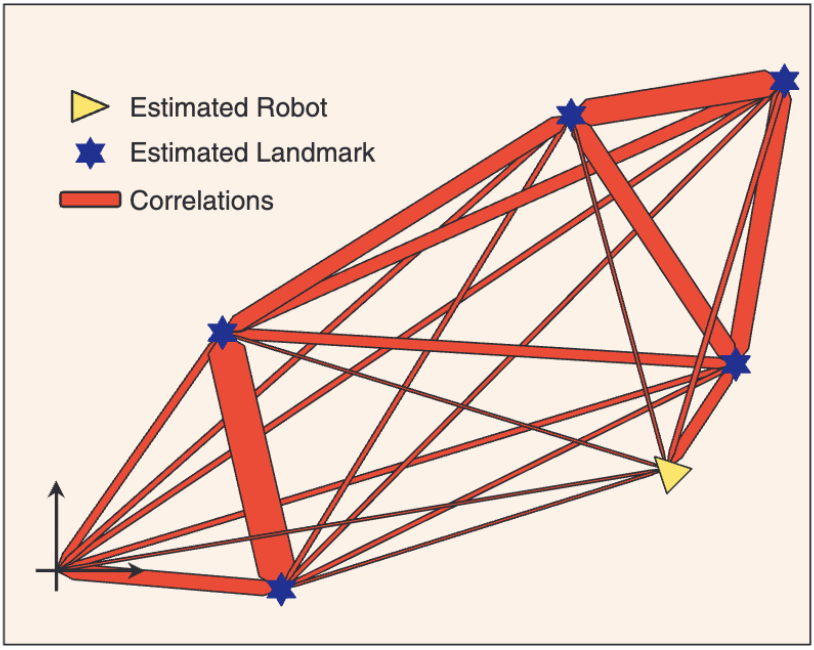
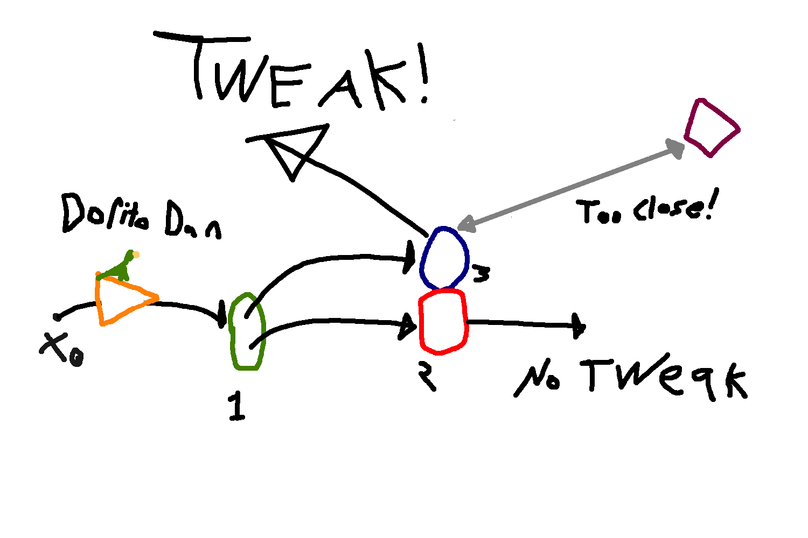
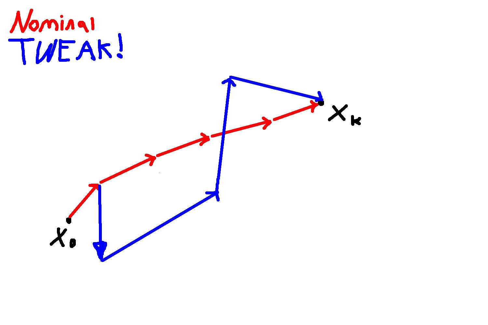

# Probabilistic Simultaneous Localization and Mapping (SLAM)

## Preface

A common problem in the field of robotics is the need to navigate through an unknown environment. The fact that the environment is unknown requires that the robot take in external data with its sensors and reason about the acquired data appropriately. By doing this, two main pieces of information are obtained:

1. **The presence and location of objects in the environment (Mapping)**
2. **The robot's own position within this environment (Localization)**

In a world where sensor and odometry data is perfectly accurate, this problem becomes trivial. Unfortunately, we don't live in such a world. Our reality check comes in the form of measurement errors propagating though our observations. This is bad, because errors in the robot's position can drive errors in the estimated location of map objects and vice versa. This can lead to a very questionable worldview on behalf of the robot. 

Lucky for us, we can tastefully abuse probability theory to compensate for our shortcomings. In doing so, we are able to simultaneously localize and map in a way wherein positional estimates converge rather than diverge as the number of consecutive sensor readings increases. 

> [!NOTE]
>
> Robots generally use multiple sensors to perform this process. Data from these multiple sensors tends to be consolidated by a process known as sensor fusion. As you may expect, different sensors provide different advantages and disadvantages. As you may expect in addition to the previously expected, the sensor suite chosen may influence which SLAM algorithm implementation makes the most sense. More on this later.

This is exactly what a SLAM system aims to do, making it a fan-favourite among roboticists for fairly obvious reasons.

## Structure

This document is intended to provide a semi-comprehensive overview of the main concepts behind the SLAM algorithm itself as well as a few of its key implementations. The main page will stick to strictly verbal and visual explanations of the concepts below but when appropriate will link to [sub-pages](#Sub-Pages) that go into more detail on the underlying math behind them for those who are interested. The [appendix](#Appendix) at the bottom of this document will contain more comprehensive documentation for the hypermasochistic.

## Part 0 - The Core Algorithm

### 0.1 - The Bumbling
The core idea behind the SLAM algorithm is to get a joint probability distribution of the robot's position and of the positions of all objects on the map. The robot starts at some origin point, makes an observation, then applies a control signal to move to the next position. 
> [!NOTE]
>
> The direction of the control signal is generally in the context of the robot's current positional awareness and whatever the path-planning process is dictating here. For our intents and purposes, we don't need to worry about the specifics of where it's pointing.

The robot's progression through the map can be modelled with a Markov Process, or 'bumbling', if you will. In this bumbling, everything is a vector, and the next state (x_k) depends only on the previous state (x_k-1). The four vector types in the upcoming diagram are explained below:  
1. x-vectors denote the robot (Wandering Dorito) position at time k, k-1 etc.
2. m-nodes represent objects on the map, assume they are time-invariant (don't move).
3. u-vectors are control signals applied at time k, k-1, ect.
4. z-vectors are distance observations made by the robot in relation to a given node at a given time. Whether or not it makes the observation is dependant on how far away from that particular object it is and if it has a clear line of 'sight'.

### Figure 0.1.1: Bumbling of The Robot

  

We will now make the assumption that the primary source of error is coming from the robot's odometer/'compass' i.e. it isn't very good at internally keeping track of its displacement relative to the accuracy obtained from its external sensors e.g. LIDAR, cameras, parrot, etc.
For maximum accuracy, we will use the parrot. With this assumption in hand, we can make the following inferences:
1. **Position errors will lead to mapping errors**
2. **If not corrected, position errors will accumulate over time leading to more and more inaccurate localization and mapping**
3. **While the absolute locations of m-nodes may be nebulous, the relative distances between nodes should be fairly accurate**
4. **Assuming the map is more accurate, we can use it to correct position errors**

1 and 2 are intuitive but what about 3? Say we take a displacement vector measurement of two points at time period T = k. There's a good chance that the robot is totally wrong about it's current position but remember, the parrot is infalible. This means that while we don't actually know where these two points are in the context of the whole map, we do have a fairly good idea of where they are in relation to each other. 

Now imagine we caffeinate the parrot and keep doing this for a disturbing amount of time. Also imagine that we try and use the relative map object distances to try and correct errors in the vehicle state as it makes observations about the map objects (i.e. triangulation). What would happen? 

### 0.2 - Core Truth of SLAM
The fundamental basis for why SLAM works is summarizeable as follows:  
>**Correlations between landmark estimates increase monotonically with the number of observations taken.**
 

This means that as we take more measurements and correct accordingly, map precision should **always** increase or at least never decrease. As we can use this map to correct position errors (as per point 4), it follows that our position estimates will also become more accurate. What this all means is that through our bumbling (Markov) process, we are able to Simultaneously refine our Localization And Mappings in parallel. SLAM is a really cool acronym, I wonder what it stands for?

### 0.3 - Sensor Noise
We can't all be parrot owners. Inferior sensors are prone to noise, and as such, can induce combobulation in our measurements. Thankfully, we can work with that. Think of sensor noise as (for our intents and purposes, and due to the law of large numbers (many measurements, remember)) a normally distributed vector with a mean value of 0 i.e. it has equal chances of overestimating the distance to a landmark by a particular amount as it does by underestimating the distance by that same amount. Then, as the numer of measurements increases, we can see that the noise begins to cancel out, allowing our slammage to continue largely unimpeded. 
>[!NOTE]
>
>1) If it's not intuitive why the noise distribution would approach a normal distribution over time, review the Central Limit Theorem.
>2) When you think about it, the noise has to have a zero-mean. If it didn't, we could just shift our sensor feed readings accordingly.
>3) There are things in the real world that can invalidate what I've stated above. We will choose to ignore them for now.

### 0.4 - Spring Network Analogy
A really useful way to think about this whole process is in the the context of a spring network. In this network, every node has a spring attached to every other node, and the robot has attachments to every node in the network. In the beginning, the springs are very soft, they can be extended or compressed easily as the relative distances between any two nodes are updated. However, as any two nodes become more and more correlated with each other (each node knows with more and more certainty where the other node is), the spring connecting them becomes more and more rigid. This means that any other node trying to push/pull on this highly correlated pair finds greater resistance towards any action that would affect the pair nodes relative distances to each other. However, if the other springs connected to the pair are still relatively soft, the pair itself can be moved around relatively freely so long as the distances between the two nodes don't change. As the robot is free to move around, the springs connecting it are perfectly stretchable/compressable and just serve as triangulation vectors for determining its position at any given time. The end state of this system after (technically infinitely) many measurements is a state wherein all springs are perfectly rigid. Since we now have this clearly defined rigid structure, it follows that our robot will also be able to accurately determine it's position by way of triangulation with the nodes composing this structure. It was probably quite boring to read all that so here's a fun diagram for your troubles:

### Figure 0.4.1: Spring Network Diagram

  

Here, the red spring thickness is directly proportional to the correlation strength between its two nodes. 

### 0.5 - Mathematical Representation
So far very little math/probability theory has been used here. This was done for two main reasons:
1. **To build intution first**
2. **Because markdown doesn't natively support LaTex**

Thankfully, Jupyter Notebooks do support LaTex. The [following document](./0-CoreAlgo/0-CoreAlgo.ipynb) goes into greater detail on the underlying math behind  what has been covered in this section for those who are interested.

## Part 1 - Extended Kalman Filter (EKF) SLAM

Extended Kalman Filters use linear algebra in conjunction with probability theory in order to operate on robot state/map information in a way that drives the convergence behaviour outlined above. 

### 1.1 Caffeinated Dorito

Our Wandering Dorito returns with a freshly caffeinated parrot. However, due to to peer pressure, the Dorito has also become robo-caffeinated; this leads to some very questionable behaviour characteristics on behalf of the robot, they will now be elaborated on. 

>[!NOTE]
>
>Robo-Caffeination is not real, it's simply some arbitrary augmentation to the robot's path-planning algorithm to make it decidedly more nonlinear for the sake of absurdity (as a visual aid). I also thought the term sounded funny.

The robot starts at position state x0 and with an internal physiological state of extreme robo-caffeination. Due to this internal state, the robot is afflicted with a case of medium-grade robo-anxiety. What this means is that after any observation, if any of the visible landmarks are observed to be within some given threshold distance of the robot, the robot will tweak. When the robot tweaks, it will do so by spinning 163.5 degrees in the counterclockwise direction (with adjustments to account for obstacles along the trajectory) and move quickly (much faster than it would normally move) away from the scene of startlage until it's time to take the next observation, upon which it will either continue to proceed normally or tweak once more depending on the observation. If the robot does not tweak, it will follow its path planning algorithm normally. 

To summarize, at any given point the robot will either:

1. Behave normally, if all landmarks are sufficiently far away 
2. Tweak, if at least one landmark is within threshold distance

What follows from these questionable behaviour characteristics is the observation that within any given bumbling process of sufficient map complexity, the mappings between input and output deltas between those two locations will be decidedly non-uniform. To illustrate, consider the following zones:

>Zone 0: Known start point, will not tweak
>
>Zone 1: All landmarks far enough away, the robot will not tweak
>
>Zone 2: Same behaviour as Zone 1
>
>Zone 3: Right next to Zone 2 but one of the landmarks crosses threshold distance, the robot will tweak. 

### Figure 1.1.1: Conundrum of the Caffeinated Dorito

  

The robot's path-path planning has it go to Zone 1 from Zone 0, take an observation, then go to Zone 2 or 3. The whole model is probabilistic, so assume it has a 50/50 chance of ending up in either Zone 2 or Zone 3 depending on where exactly it was in Zone 1 before. Now we will think about the transitions in terms of forecast (time update) state uncertainty.

The first state is easy. State 1 is a function of x0, and even if x0 was a distribution, we'd get a pretty well-centered distribution for state x1, which would lie inside Zone 1. Zones 2 and 3 are also easy to find as a function of Zone 1. The problem with 2 and 3 is that the forecast state estimates are totally different. It's not like if you move over a little bit from Zone 2 to Zone 3 the output is also shifted by the same nudge vector, it's completely different. 

What this means is that different areas (and thus states) have different levels of forecast state uncertainty. For example, the border between Zone 2 and Zone 3 will have way more uncertainty than the area around Zone 1 with regards to where the next state will be.

This is problematic, because over a walk (bumbling) of sufficient complexity, there can be cases where the robot may end up in a given position due to two different processes. One with lots of tweakage, one with little tweakage. This means that the current state may no longer encode which path the robot took to get there, thus the Markov property is violated. If the Markov property is violated, forecast state estimation based only on the current state is no longer possible, and thus neither is our algorithm from part 0.

This is a problem indeed, and we now have a rationalization for why we'd want an EKF. 

### 1.2 EKF Core 

Put simply, the whole point of an EKF is to encode state transition information in a way that allows the Markov property to be assumed, which is essential for our algorithm from [Part 0](./0-CoreAlgo/0-CoreAlgo.ipynb) to work. To do this, we make use of two key principles:

1. Linearization allows the system to approximate nonlinear dynamics as locally linear.

2. Locally linear models preserve the Markov property by ensuring that uncertainty propagation via covariance remains mathematically consistent. 

This allows the EKF to encode the effects of nonlinear behavior through propagating uncertainty. What this means can be explained intuitively in the following example:

### Figure 1.2.1: Path Comparison

  

>[!NOTE]
> Tweak sequence is not to scale

Let's say after k steps we are at a position (state, same thing) xk. For the sake of argument and simplicity, let's assume that at time period T=k, there are exactly two ways we could end up at this state:

1. By following the completely nominal trajectory for all k steps (no tweakages)

2. A most cantankerous tweak sequence (all tweakages after the first step)

How do we differentiate the two? If we didn't have an EKF or some analogous method, we wouldn't be able to. But we do have an EKF, and so the differentiator lies in the Kalman Gain value of the filter at the end of both of these sequences. What is meant by this is that both sequences propagate different amounts of covariance (uncertainty) through the system at different times, the kalman filter tracks this uncertainty and adapts to it accordingly, thus each unique process is reflected through a different Kalman Gain value at time T=k. 

This Kalman gain is then used to adapt our forecast estimates with regards to our observations (measurement update) in a manner that is compliant with the overarching SLAM algorithm delineated [here](./0-CoreAlgo/0-CoreAlgo.ipynb).

This part of the document was intentionally kept very non-rigorous for much the same reasons as Part 0. The actual math behind what was described is elaborated on [here](./1-EKF/1-EKF.ipynb).

## Part 2 - GraphSLAM

I haven't written this yet.

## Sub-Pages
[Part 0](./0-CoreAlgo/0-CoreAlgo.ipynb)

[Part 1](./1-EKF/1-EKF.ipynb)

## Appendix

[Simultaneous Localisation and Mapping (SLAM)
Part I The Essential Algorithms](./resources/Durrant-Whyte_Bailey_SLAM-tutorial-I.pdf)  
[SLAM For Dummies](./resources/slam_for_dummies.pdf)  
[Extended Kalman Filter Tutorial](./resources/tutorialEKF.pdf)  